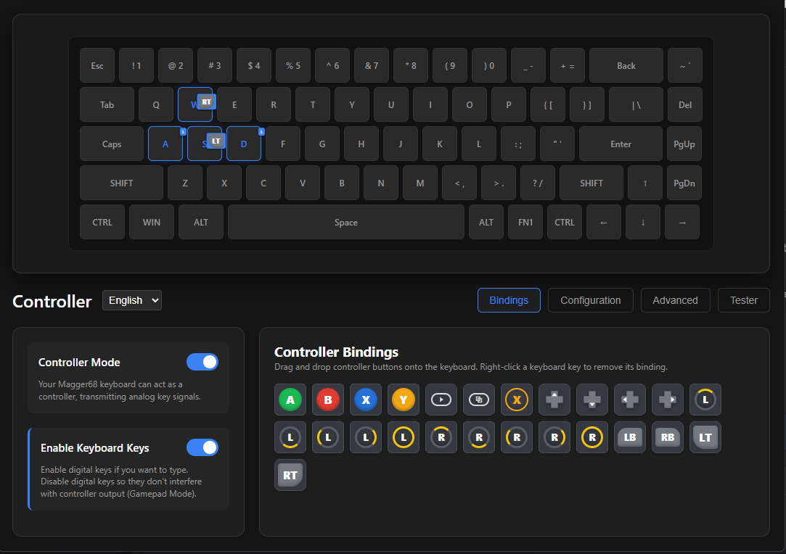

<div align="center">
  
  
  # LuminkeyAnalogInput
  
  **The ultimate software to unleash the full potential of your Luminkey keyboard.**
  
  [](https://opensource.org/licenses/MIT)
</div>

<br>

<div align="center">
  
</div>

## Overview

**LuminkeyAnalogInput** open-source utility that transforms your keyboard into a fully functional analog controller. It intercepts the raw, continuous actuation depth of your keypresses and maps them directly to gamepad axes or advanced keyboard macros.

Whether you want to smoothly steer cars in racing games, seamlessly control your character's walking speed, or gain a competitive edge in shooters with Snap Tap and Rapid Trigger — this tool has you covered.


### Full Analog Gamepad Emulation
Map the physical depth of your keystrokes directly to Xbox 360 controller axes (Analog Sticks or Triggers).
- **Steer with precision**: Lightly press a key to turn slightly, or bottom out for a sharp turn.
- **Adjustable Response Curves**: Fine-tune the actuation curve. Set custom starting/ending deadzones and shape the curve exactly to your liking.
- **True Gamepad Mode**: Automatically hides your physical keyboard inputs from Windows while enabled, preventing games from spastically switching between "Keyboard" and "Controller" UI prompts.


### Multilingual UI
 **English** and **Russian**

## Requirements & Drivers

To achieve zero-latency kernel-level interception and virtual gamepad emulation, the application relies on three drivers. The built-in dashboard will automatically detect them and offer 1-click installation!

1. **ViGEmBus**: Allows Windows to recognize the emulated Xbox 360 controller.
2. **Interception**: A kernel-level driver that reads raw keyboard input *before* Windows processes it.
3. **HidHide**: Hides your original physical keystrokes from the game to avoid double-inputs.

## Installation

1. Download the latest `LuminkeyAnalogInput.exe` from the [Releases](https://github.com/DEN41R/LuminkeyAnalogInput/releases) page.
2. Run the executable.
3. On the **Configuration** tab, check the "Drivers" section. If any are missing, click **Install**.
4. **Reboot your PC** after installing kernel-level drivers.
5. Launch the app and enjoy!

## Building from Source

If you want to modify the code or build the executable yourself:

1. Clone the repository.
2. Install Python 3.10+ and create a virtual environment (`python -m venv .venv`).
3. Run `build.py`:
   ```bash
   .venv\Scripts\python build.py
   ```
4. The script will automatically install all required dependencies (`pyinstaller`, `pywebview`, `vgamepad`, `hidapi`) and generate a standalone `.exe` in the `dist/` folder.

## 📄 License

This project is open-source and available under the MIT License.
